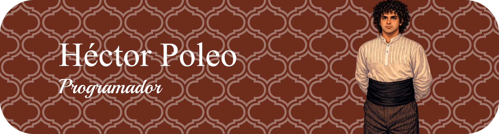

🎓 Estudiante de 1º de Desarrollo de Aplicaciones Multiplataforma (DAM)  
💡 Apasionado por la programación, el diseño de interfaces y el desarrollo de ideas creativas  
🚀 Explorando nuevas tecnologías cada día  

---

## 🛠️ Tecnologías que estoy aprendiendo

---

## 📂 Proyectos destacados

- 🎮 **Juego del Ahorcado** — Aplicación desarrollada con Java y JavaFX  
- 🎮 **Biblioteca Fate** — Aplicación desarrollada con Java y JavaFX  

---

## 📫 Contacto

¿Te interesa colaborar o simplemente charlar sobre desarrollo?

---
